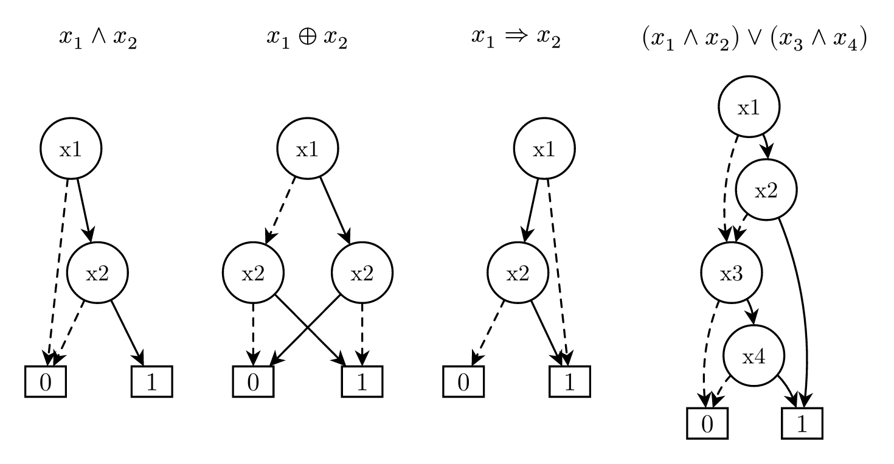
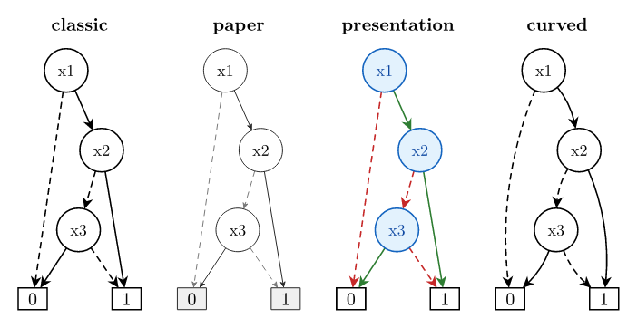
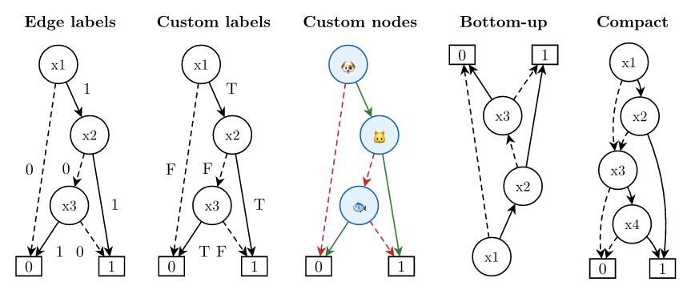

# typdd — Decision Diagram Visualization for Typst

A [Typst](https://typst.app) package for visualizing Binary Decision Diagrams (BDDs). Write a boolean expression, get a publication-ready diagram.

**Requires Typst >= 0.12 and [fletcher](https://typst.app/universe/package/fletcher) >= 0.5.8**

## Skills

This project is also available as a [Claude Code](https://claude.com/code) plugin. Install to get your ai agents equipped with `/typdd` skill:

```
/plugin marketplace add https://github.com/hmyuuu/typdd
/plugin install typdd
```

## Usage

```typ
#import "@preview/typdd:0.1.0": *

#bdd("x1 & x2")
#bdd("x1 ^ x2")
#bdd("x1 => x2")
#bdd("(x1 & x2) | (x3 & x4)", compact: true)
```



All standard operators are supported: `&` (AND), `|` (OR), `!` (NOT), `^` (XOR), `=>` (IMPLIES), `~&` (NAND), `~|` (NOR), `~^` (XNOR), and `ite(c, t, f)`.

## Style Presets

Built-in styles: `classic` (default), `paper`, `presentation`, and `curved`.

```typ
bdd("x1 & (x2 | !x3)", style: "classic")
bdd("x1 & (x2 | !x3)", style: "paper")
bdd("x1 & (x2 | !x3)", style: "presentation")
bdd("x1 & (x2 | !x3)", style: "curved")
```



## Options

Edge labels (default or custom), custom node labels, layout direction, compact mode, and target height.

```typ
bdd("x1 & (x2 | !x3)", show-edge-labels: true)
bdd("x1 & (x2 | !x3)", show-edge-labels: ("T", "F"))
bdd("a & (b | !c)", labels: (a: "🐶", b: "🐱", c: "🐟"), style: "presentation")
bdd("x1 & (x2 | !x3)", direction: "BT")
bdd("(x1 & x2) | (x3 & x4)", compact: true, style: "curved", height: 2cm)
```



## API

### `bdd(expr, ..options)`

| Parameter | Type | Default | Description |
|-----------|------|---------|-------------|
| `expr` | `str` | required | Boolean expression |
| `style` | `str` | `"classic"` | `classic` / `paper` / `presentation` / `curved` |
| `order` | `array` | `none` | Variable ordering |
| `labels` | `dict` | `(:)` | Variable display names |
| `show-edge-labels` | `bool` / `array` | `false` | `true` for 0/1, or `("high", "low")` for custom |
| `direction` | `str` | `"TB"` | `TB` / `BT` / `LR` / `RL` |
| `width` | `length` | `auto` | Target width — adjusts node spacing |
| `height` | `length` | `auto` | Target height — adjusts level spacing |
| `scale` | `float` | `1.0` | Uniform zoom factor |
| `compact` | `bool` | `false` | Tighter spacing for large BDDs |
| `center-root` | `bool` | `true` | Center diagram on root node |
| `node-sep` | `length` | `auto` | Horizontal spacing between nodes |
| `level-sep` | `length` | `auto` | Vertical spacing between levels |
| `reduced` | `bool` | `true` | Apply BDD reduction |

### `bdd-from-json(data, ..options)`

Import a BDD from JSON interchange format. Same rendering options as `bdd()`.

## Development

```bash
make install   # install dependencies
make test      # run all tests
make examples  # compile examples to PNG
```

See [AGENTS.md](AGENTS.md) for development guide.

## License

[MIT](LICENSE)
